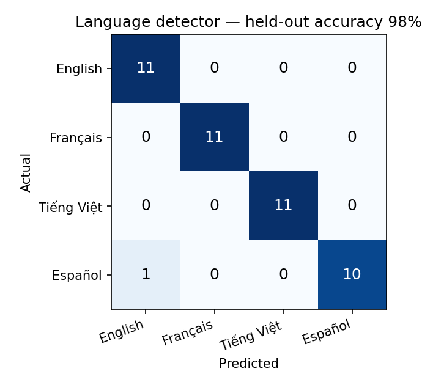

# Polyglot 🗣️ — guess my language

[](https://github.com/danielduongg/polyglot-detector/actions)

**Type a phrase in any of my four languages — English, French, Vietnamese, or Spanish — and a tiny machine-learning model guesses which one, live in your browser.**

A fun, personal ML project: a character n-gram **Naïve Bayes** language detector trained on
~180 hand-written sentences across the four languages I speak, then exported to run entirely
client-side (no server, no API). Wrapped in a Vietnamese-inspired UI whose interface itself
toggles between all four languages. Built by a polyglot triathlete 🏊 🎾 🚴.

> **Try it:** open [`index.html`](index.html) — no build step, no internet needed.

## What it does

- Detects **EN / FR / VI / ES** from any phrase and shows a confidence bar for each.
- **97.7% held-out accuracy** on a 44-sentence test split; the live model is only **10 KB**.
- The whole interface (labels, hints, examples) switches between the four languages.



## How it works

1. **Corpus** (`data/corpus.py`) — ~45 original sentences per language, themed around
   swimming, triathlon, tennis, food, and everyday life.
2. **Model** (`train.py`) — text → character n-grams (1–2) → per-language Laplace-smoothed
   Naïve Bayes. Character n-grams are great for language ID because accented and
   Vietnamese characters (é, ç, ñ, ơ, ư, đ, …) are highly discriminative.
3. **Export** — the learned counts/priors are written to `model/lang_model.json` and embedded
   in `index.html`, which re-implements the exact classifier in ~20 lines of JavaScript so it
   runs in the browser.

```bash
# retrain / reproduce (optional)
pip install -r requirements.txt
python train.py          # writes model/lang_model.json + results/ + confusion matrix
# then rebuild the page:  python .build_html.py   (injects the model into index.html)
```

## Files

```
polyglot-detector/
├── index.html              # the app (open this) — model embedded, runs offline
├── train.py                # train + evaluate + export the model
├── data/corpus.py          # the 4-language sentence corpus
├── model/lang_model.json   # exported model parameters (10 KB)
├── results/                # metrics.json + confusion matrix figure
└── README.md
```

## Notes

Trained on a small, hand-written corpus, so it shines on everyday phrases in these four
languages and is not meant to compete with production language-ID systems — it's a compact,
fully transparent, and personal demonstration of how simple character statistics already
separate languages remarkably well. Seeded and reproducible (`SEED = 20260617`).

## License

MIT — see [`LICENSE`](LICENSE).
